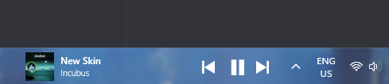

# Spotify Taskbar Widget




A native Windows 11 widget that embeds Spotify playback controls directly inside your taskbar. Built with C# WPF and Win32 interop (P/Invoke).

The main reason I made this was because the spotify miniplayer messes with my tab sequence when I alt tab
## Features

- **Taskbar-Embedded**: Appears inside the Windows 11 taskbar as a native-feeling widget — not a floating window
- **Real-time Playback**: Shows currently playing track with album art, song title (scrolling marquee), and artist name
- **Playback Controls**: Play/Pause, Next, Previous track buttons
- **Adaptive Polling**: Smart API polling — 1s during playback, 10s paused, 30s idle
- **Theme Matching**: Automatically matches Windows 11 dark/light mode and accent colors
- **Explorer Resilience**: Auto-re-embeds when explorer.exe restarts
- **Idle State**: Shows last played track greyed out when nothing is playing
- **Secure Auth**: OAuth 2.0 PKCE flow — no client secret stored locally
- **Auto-Start**: Launches with Windows (configurable via tray icon menu)
- **System Tray**: Right-click tray icon for settings, re-auth, and quit

## Prerequisites

- Windows 11
- [.NET 8 Runtime](https://dotnet.microsoft.com/download/dotnet/8.0) (or build from source with .NET SDK)
- A [Spotify Premium](https://www.spotify.com/premium/) account (required for Web API playback control)
- A Spotify Developer application (see Setup)

## Setup

### 1. Create a Spotify Developer App

1. Go to [Spotify Developer Dashboard](https://developer.spotify.com/dashboard)
2. Click **Create App**
3. Set the **Redirect URI** to: `http://127.0.0.1:5543/callback`
4. Note your **Client ID**

### 2. Configure the Widget

Create `SpotifyTaskbarWidget/.env` with your Client ID:

```
SPOTIFY_CLIENT_ID=your_client_id_here
```

The file is gitignored and copied next to the executable on build. `SPOTIFY_CLIENT_ID`
can also be set as an environment variable instead. If neither is present, the
built-in default in `App.xaml.cs` is used.

> ensure that your spotify account's email is added under **Settings → User Management**, or the Web API will return `403 Forbidden` on every call.

### 3. Build & Run

```bash
# Restore packages
dotnet restore

# Build
dotnet build

# Run
dotnet run --project SpotifyTaskbarWidget
```

### 4. Publish (Optional)

Create a self-contained single-file executable:

```bash
dotnet publish SpotifyTaskbarWidget -c Release -r win-x64 --self-contained
```

## System Tray Menu

- **Start with Windows** Toggle auto-start
- **Re-authenticate** Log in again with a different Spotify account
- **About** Version information
- **Quit** Exit the widget

## License

[MIT](LICENSE)
